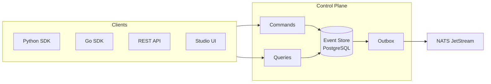

<h3 align="center">DuraGraph</h3>
<h4 align="center">The open-source AI workflow control plane built for production.</h4>

<p align="center">
  <a href="https://duragraph.ai/docs"><strong>Docs</strong></a> · <a href="https://github.com/orgs/Duragraph/projects/1"><strong>Roadmap</strong></a> · <a href="https://duragraph.ai/docs/user-guide/installation/self-hosted"><strong>Self-Host Guide</strong></a>
</p>

---

DuraGraph is a self-hosted control plane for AI workflows. It orchestrates multi-step agent pipelines with **event sourcing**, **CQRS**, and **horizontal scaling** — giving you a full audit trail, point-in-time state reconstruction, and zero mutable state.

Deploy it on your infrastructure. Connect any LLM. Observe everything.

## Why DuraGraph

| | |
|---|---|
| **Event-Sourced by Design** | Every state change is an immutable event. Replay, audit, and debug any workflow execution from the first token to the last. |
| **True Self-Hosted Control Plane** | Not a managed service with a self-hosted afterthought. DuraGraph is built from the ground up for your infrastructure. |
| **Horizontally Scalable** | Optimistic concurrency, lease-epoch fencing, and the transactional outbox pattern — scale workers independently of the control plane. |
| **Open Architecture** | PostgreSQL event store, NATS JetStream for messaging, Prometheus metrics. No proprietary runtimes or opaque state stores. |
| **Multi-LLM Native** | First-class support for OpenAI, Anthropic, and any provider. Switch models per-node without changing your graph. |
| **Polyglot SDKs** | Python, Go, and TypeScript clients — not a single-language ecosystem. |

## Quick Start

```bash
# Pull and run
docker compose -f https://raw.githubusercontent.com/Duragraph/duragraph/main/deploy/docker-compose.yml up -d

# Verify
curl http://localhost:8081/health
```

Or build from source:

```bash
git clone https://github.com/Duragraph/duragraph.git
cd duragraph
task up
```

## Repositories

| Repository | Description |
|---|---|
| [`duragraph`](https://github.com/Duragraph/duragraph) | Core control plane — Go, Echo, PostgreSQL, NATS |
| [`duragraph-python`](https://github.com/Duragraph/duragraph-python) | Python SDK — graph definitions, async workers, pydantic models |
| [`duragraph-go`](https://github.com/Duragraph/duragraph-go) | Go SDK — type-safe client with generics |
| [`duragraph-studio`](https://github.com/Duragraph/duragraph-studio) | Visual workflow editor and execution dashboard |
| [`duragraph-docs`](https://github.com/Duragraph/duragraph-docs) | Documentation site — [duragraph.ai/docs](https://duragraph.ai/docs) |
| [`duragraph-spec`](https://github.com/Duragraph/duragraph-spec) | API specifications — OpenAPI, AsyncAPI |
| [`duragraph-examples`](https://github.com/Duragraph/duragraph-examples) | Runnable examples across all SDKs |
| [`duragraph-enterprise`](https://github.com/Duragraph/duragraph-enterprise) | Enterprise features — RBAC, SSO, audit logs, SLA enforcement |

## Architecture



Commands write events. Queries read projections. The outbox guarantees delivery to NATS JetStream. Workers pick up tasks, execute graph nodes against LLMs, and report results as new events. No state is ever mutated.

## Migrating from LangGraph?

DuraGraph provides a compatibility layer for LangGraph Cloud APIs. See the [migration guide](https://duragraph.ai/docs/user-guide/tutorials/langgraph-migration) to move your existing workflows over.

## License

Core components are [Apache 2.0](https://www.apache.org/licenses/LICENSE-2.0). Enterprise features are source-available.

---

<p align="center">
  <a href="https://duragraph.ai">duragraph.ai</a> · <a href="mailto:hello@duragraph.ai">hello@duragraph.ai</a>
</p>
