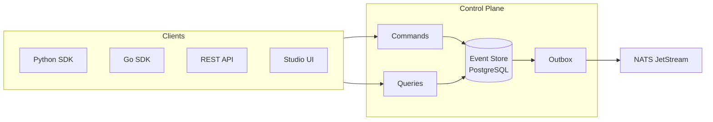

<h3 align="center">DuraGraph</h3>
<h4 align="center">The open-source AI workflow control plane built for production.</h4>

<p align="center">
  <a href="https://duragraph.ai/docs"><strong>Docs</strong></a> · <a href="https://github.com/orgs/Duragraph/projects/1"><strong>Roadmap</strong></a> · <a href="https://duragraph.ai/docs/user-guide/installation/self-hosted"><strong>Self-Host Guide</strong></a>
</p>

---

DuraGraph is a self-hosted control plane for AI workflows. It orchestrates multi-step agent pipelines with **event sourcing**, **CQRS**, and **horizontal scaling** — giving you a full audit trail, point-in-time state reconstruction, and zero mutable state.

Deploy it on your infrastructure. Connect any LLM. Observe everything.

## Why DuraGraph

| | |
|---|---|
| **Event-Sourced by Design** | Every state change is an immutable event. Replay, audit, and debug any workflow execution from the first token to the last. |
| **True Self-Hosted Control Plane** | Not a managed service with a self-hosted afterthought. DuraGraph is built from the ground up for your infrastructure. |
| **Horizontally Scalable** | Optimistic concurrency, lease-epoch fencing, and the transactional outbox pattern — scale workers independently of the control plane. |
| **Open Architecture** | PostgreSQL event store, NATS JetStream for messaging, Prometheus metrics. No proprietary runtimes or opaque state stores. |
| **Multi-LLM Native** | First-class support for OpenAI, Anthropic, and any provider. Switch models per-node without changing your graph. |
| **Polyglot SDKs** | Python and Go clients today, more languages on the roadmap. |

## Quick start

The fastest path is the single-binary dev mode — embedded Postgres + NATS, no Docker needed:

```bash
# macOS / Linux (Homebrew tap)
brew install Duragraph/tap/duragraph
duragraph dev --studio

# Open the dashboard at http://localhost:8081/
```

Or run via Docker:

```bash
docker run --rm -p 8081:8081 duragraph/duragraph:latest dev --studio
```

For production deployment with external Postgres and NATS, see the [self-host guide](https://duragraph.ai/docs/user-guide/installation/self-hosted).

## Repositories

DuraGraph lives in a single monorepo (`Duragraph/duragraph`) with one external companion:

| Path / Repo | Description |
|---|---|
| [`Duragraph/duragraph`](https://github.com/Duragraph/duragraph) | Monorepo root — Go control plane (Echo, PostgreSQL, NATS) with embedded dashboard + Studio |
| └ [`python/`](https://github.com/Duragraph/duragraph/tree/main/python) | Python SDK — graph definitions, async workers, pydantic models. PyPI: [`duragraph`](https://pypi.org/project/duragraph/) |
| └ [`go-sdk/`](https://github.com/Duragraph/duragraph/tree/main/go-sdk) | Go SDK — type-safe client with generics. [`pkg.go.dev`](https://pkg.go.dev/github.com/duragraph/duragraph/go-sdk) |
| └ [`studio/`](https://github.com/Duragraph/duragraph/tree/main/studio) | Visual workflow editor (embedded into the control-plane binary) |
| └ [`docs/`](https://github.com/Duragraph/duragraph/tree/main/docs) | Documentation site source — [duragraph.ai/docs](https://duragraph.ai/docs) |
| └ [`examples/`](https://github.com/Duragraph/duragraph/tree/main/examples) | Runnable examples across all SDKs |
| [`Duragraph/duragraph-enterprise`](https://github.com/Duragraph/duragraph-enterprise) | Enterprise features — RBAC, SSO, audit logs, SLA enforcement (source-available) |

## Architecture



Commands write events. Queries read projections. The outbox guarantees delivery to NATS JetStream. Workers pick up tasks, execute graph nodes against LLMs, and report results as new events. No state is ever mutated.

## License

Core components are [Apache 2.0](https://www.apache.org/licenses/LICENSE-2.0). Enterprise features are source-available.

---

<p align="center">
  <a href="https://duragraph.ai">duragraph.ai</a> · <a href="mailto:hello@duragraph.ai">hello@duragraph.ai</a>
</p>
